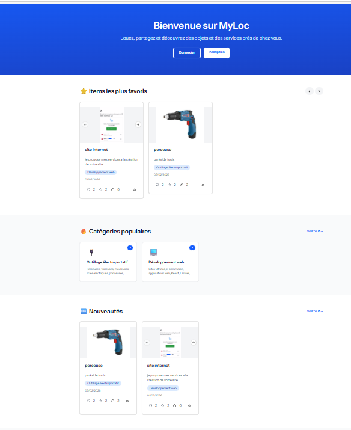
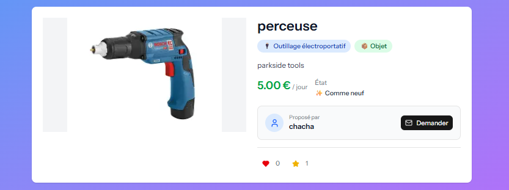
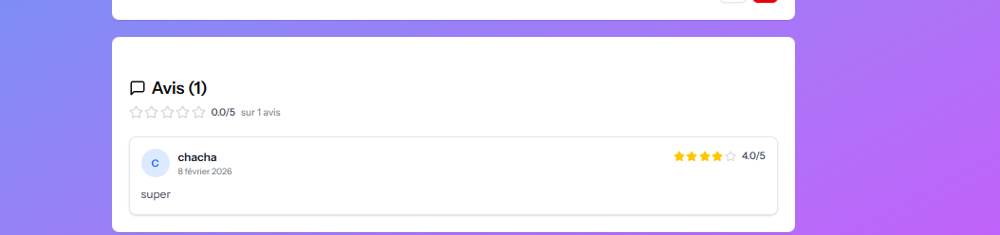
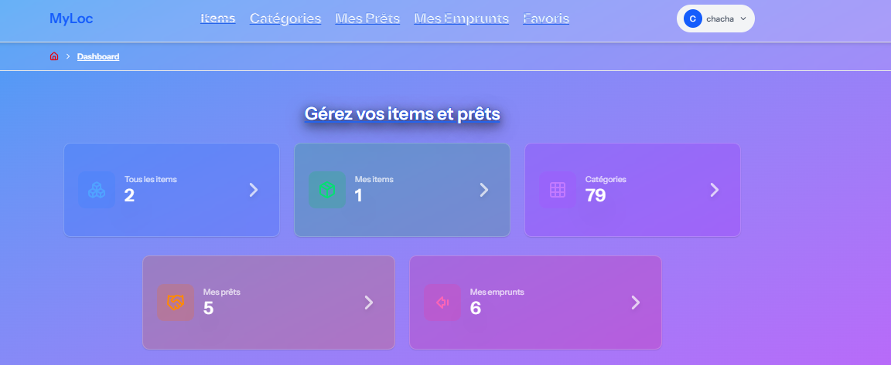

# 🏠 MyLoc 2.0

<div align="center">


**Plateforme hybride de partage et location d'objets avec système de réservation de services**

[📋 Voir le ROADMAP](./ROADMAP.md) • [🏗️ Architecture](./Architecture.md) • [🐛 Signaler un bug](https://github.com/chabriermanu/My_loc_with_-lavarel_12/issues)

</div>

---

## 📖 À propos du projet

**MyLoc 2.0** est une refonte complète du projet initial Symfony vers **Laravel 12**, développée dans le cadre de ma formation de Développeur Web Full Stack à l'AFPA. Cette plateforme permet aux utilisateurs de :

- 🎁 **Partager et emprunter** des objets entre particuliers
- 🛠️ **Proposer et réserver** des services
- 📍 **Géolocaliser** les annonces avec calcul de distance
- ❤️ **Favoriser, liker et commenter** les annonces
- 🔒 **Respecter le RGPD** avec système de consentement
- ⭐ **Noter** les items et les utilisateurs
- 💬 **Communiquer** via messagerie intégrée

---

## ✨ Fonctionnalités principales

### 🎯 Gestion des annonces

- ✅ Création d'annonces (objets ou services)
- 📂 Catégorisation avancée (77 catégories hiérarchiques)
- 🖼️ Upload multiple d'images avec carousel
- 🔍 Recherche et filtres par catégorie/type
- 💬 Système de commentaires avec réponses imbriquées (architecture Clean Code)
- ❤️ Likes et favoris avec compteurs
- ⭐ Système de notation items (moyenne calculée automatiquement)

### 📍 Géolocalisation

- 🗺️ Localisation automatique via API externe
- 📏 Calcul de distance entre utilisateurs (formule Haversine)
- 🎯 Matching par proximité géographique
- 🔐 Partage RGPD-compliant des coordonnées

### 👤 Gestion utilisateur

- 🔐 Authentification sécurisée (Laravel Fortify)
- 🔑 Authentification à deux facteurs (2FA)
- 📧 Vérification email
- 📋 Profil utilisateur complet
- 🌐 Géolocalisation du profil
- ⚙️ Gestion des préférences (localisation, apparence)
- ✅ Modale de consentement RGPD au premier login
- ⭐ Système d'avis bidirectionnel (emprunteur/prêteur)

### 📝 Système de prêt/réservation

- 📅 Demandes de prêt avec statuts (pending, approved, in_progress, completed, cancelled, overdue)
- 📍 Matching géographique automatique
- 💬 Messagerie interne par prêt avec interface chat
- 🔐 Partage sécurisé des coordonnées (email/téléphone/adresse)
- ✉️ 5 Notifications email automatisées
- 📊 Historique complet des emprunts
- ⭐ Système d'avis bidirectionnel après prêt

### 👑 Administration

- 🗂️ Gestion complète des catégories (CRUD)
- 📊 Système de popularité des items
- 🔧 Interface d'administration dédiée
- 🛡️ Middleware admin avec vérification de rôle

### 📄 Conformité légale & Sécurité

- 📜 Conditions Générales d'Utilisation (CGU)
- 🔒 Politique de confidentialité
- ✅ Système de consentement utilisateur multi-types
- 🗑️ Révocation de consentement
- 📥 Export des données personnelles (RGPD)
- 🛡️ **6 Policies Laravel** pour autorisation granulaire
- 🔐 Protection CSRF sur toutes les routes sensibles
- 🚫 Rate limiting sur routes critiques

### 💬 Système de Messagerie

- 💾 Messages persistants en base de données
- 🎨 Interface de chat intuitive (MessageBox component)
- 📜 Historique complet des conversations par prêt
- 📝 Formulaire d'envoi avec raccourci clavier (Enter)
- 🔄 Actualisation pour voir les nouveaux messages
- 🎯 Auto-scroll automatique vers dernier message

---

## 🛠️ Stack technique

### Backend

- **Laravel 12** - Framework PHP moderne
- **PHP 8.2+** - Langage backend
- **MySQL 8.0+** - Base de données relationnelle
- **Laravel Fortify** - Authentification complète (login, 2FA, email verification)
- **Laravel Sanctum** - Authentification API
- **Pusher** - Infrastructure temps réel (prêt pour broadcasting)
- **API Géocodage** - Service de localisation externe
- **Mailtrap** - Service SMTP de développement

### Frontend

- **React 19** - Bibliothèque UI
- **TypeScript 5** - Typage statique JavaScript
- **Inertia.js 2** - Bridge Laravel/React (SPA moderne sans API)
- **Tailwind CSS 4** - Framework CSS utility-first
- **shadcn/ui** - Composants UI accessibles (Radix UI)
- **Lucide React** - Bibliothèque d'icônes
- **Embla Carousel** - Carousel pour galeries photos

### DevOps & Tooling

- **Vite 5** - Build tool ultra-rapide
- **Docker** - Containerisation (docker-compose.yaml)
- **Laravel Wayfinder** - Génération automatique de routes TypeScript
- **Laravel Pint** - Code style PHP (PSR-12)
- **ESLint** - Linting TypeScript/React
- **Git** - Versioning avec GitHub

---

## 📊 Statistiques du projet

### Backend

- **27 migrations** - Schéma de base de données complet
- **12 modèles Eloquent** - Relations complexes (polymorphiques, bidirectionnelles)
- **14 controllers** - Architecture RESTful
- **14+ Form Requests** - Validation centralisée et réutilisable
- **6 Policies** - Autorisation granulaire (Item, Comment, Loan, Review, Category, User)
- **5 Notifications** - Système d'alertes email
- **2 Services** - GeocodingService, EventBroadcasting
- **2 Traits** - Likable (polymorphisme), HasReviews
- **1 Event** - MessageSent (broadcasting)

### Frontend

- **31 pages Inertia.js** - Navigation SPA fluide sans rechargement
- **60+ composants** - Réutilisabilité maximale et maintenabilité
- **~4000 lignes TypeScript** - Code typé et robuste
- **9 composants Reviews/Comments** - Architecture Clean Code (SOLID)
- **8+ hooks personnalisés** - Logique métier réutilisable
- **160+ routes auto-générées** - Wayfinder pour type-safety

### Base de données

- **12 tables principales** - Modélisation normalisée
- **Relations complexes** - Parent/enfant, polymorphiques (likes), bidirectionnelles (reviews)
- **Index optimisés** - Performance des requêtes
- **Contraintes d'intégrité** - Foreign keys avec cascade

---

## 🏗️ Architecture Clean Code - Composants modulaires

### 📁 Composants Comments (Refactoring 9 fév. 2026)

Le système de commentaires a été **refactorisé** selon les **principes SOLID** :
```
components/Comments/
├── CommentSection.tsx      # Orchestrateur principal (70 lignes, -72%)
├── CommentForm.tsx         # Formulaire création/édition (40 lignes)
├── ReplyForm.tsx           # Formulaire de réponse (35 lignes)
└── CommentItem.tsx         # Affichage récursif (120 lignes)
```

**Résultats du refactoring :**

- ✅ **-72% de lignes** dans CommentSection (250 → 70 lignes)
- ✅ **Single Responsibility** - Un composant = une responsabilité
- ✅ **Composant récursif** pour réponses imbriquées illimitées
- ✅ **Réutilisable** et facilement testable
- ✅ **DRY** - Aucune duplication de code

### 📁 Composants Reviews (Complet 9 fév. 2026)

Système complet de notation avec **5 composants modulaires** :
```
components/Reviews/
├── StarRating.tsx          # Affichage/saisie étoiles interactives (80 lignes)
├── ReviewSection.tsx       # Section d'affichage avec stats (120 lignes)
├── ReviewCard.tsx          # Carte d'un avis individuel (60 lignes)
├── ItemReviewForm.tsx      # Formulaire d'avis sur item (90 lignes)
└── UserReviewForm.tsx      # Formulaire d'avis utilisateur (110 lignes)
```

**Fonctionnalités avancées :**

- ⭐ **Demi-étoiles** pour moyennes précises (ex: 4.5/5)
- 🎨 **Mode interactif** avec hover preview avant validation
- 📊 **Calcul automatique** des moyennes côté backend
- 🎯 **Validation** côté client (TypeScript) et serveur (FormRequest)
- ♻️ **Réutilisable** pour items ET utilisateurs

### 📁 Composants Loans
```
components/Loans/
├── LoanCard.tsx            # Carte prêt avec badges de statut (100 lignes)
└── MessageBox.tsx          # Messagerie intégrée chat-style (150 lignes)
```

**MessageBox fonctionnalités :**

- 💬 Interface de chat moderne
- 📜 Historique messages avec scroll automatique
- ⌨️ Raccourci clavier Enter pour envoyer
- 🎨 Messages différenciés (émetteur/récepteur)
- 🔄 Refresh pour nouveaux messages

---

## 🛡️ Sécurité & Autorisations

### Policies Laravel (6 policies)
```php
app/Policies/
├── ItemPolicy.php          # Autorisation CRUD items
├── CommentPolicy.php       # Autorisation commentaires
├── LoanPolicy.php          # Autorisation prêts et messagerie
├── ItemReviewPolicy.php    # Autorisation avis items
├── UserReviewPolicy.php    # Autorisation avis utilisateurs
└── CategoryPolicy.php      # Autorisation admin catégories
```

**Méthodes d'autorisation implémentées :**

- `viewAny()` - Lister les ressources
- `view()` - Voir une ressource
- `create()` - Créer une ressource
- `update()` - Modifier une ressource
- `delete()` - Supprimer une ressource
- `sendMessage()` - Envoyer un message (Loan)
- `shareContact()` - Partager coordonnées (Loan)

**Logique d'autorisation :**

- ✅ Utilisateur propriétaire
- ✅ Administrateur (catégories)
- ✅ Parties prenantes du prêt (emprunteur/prêteur)
- ✅ Vérifications conditionnelles (statut, dates, etc.)

### Middleware & Validations

- 🔐 **CSRF Protection** sur toutes requêtes POST/PUT/DELETE
- 🛡️ **EnsureIsAdmin** middleware pour routes admin
- ✅ **Form Requests** avec règles de validation strictes
- 🚫 **Rate Limiting** sur routes sensibles
- 🔑 **Sanctum** pour authentification API

---

## 📦 Installation

### Prérequis

- PHP >= 8.2
- Composer >= 2.6
- Node.js >= 18 & npm >= 9
- MySQL >= 8.0
- Git

### Étapes d'installation
```bash
# 1. Cloner le repository
git clone https://github.com/chabriermanu/My_loc_with_-lavarel_12.git
cd My_loc_with_-lavarel_12

# 2. Installer les dépendances PHP
composer install

# 3. Installer les dépendances JavaScript
npm install

# 4. Copier le fichier d'environnement
cp .env.example .env

# 5. Générer la clé d'application
php artisan key:generate

# 6. Configurer la base de données dans .env
# DB_CONNECTION=mysql
# DB_HOST=127.0.0.1
# DB_PORT=3306
# DB_DATABASE=myloc
# DB_USERNAME=root
# DB_PASSWORD=

# 7. (Optionnel) Configurer Mailtrap pour emails de dev
# MAIL_MAILER=smtp
# MAIL_HOST=sandbox.smtp.mailtrap.io
# MAIL_PORT=2525
# MAIL_USERNAME=your_username
# MAIL_PASSWORD=your_password

# 8. (Optionnel) Configurer API Géocodage
# GEOCODING_API_KEY=your_api_key

# 9. Lancer les migrations
php artisan migrate

# 10. (Optionnel) Remplir avec des données de test
php artisan db:seed

# 11. Créer le lien symbolique pour le storage
php artisan storage:link

# 12. Compiler les assets
npm run dev
```

### Lancement
```bash
# Terminal 1 - Serveur Laravel
php artisan serve

# Terminal 2 - Serveur Vite (dev)
npm run dev

# Terminal 3 - Queue worker (pour notifications)
php artisan queue:work

# Accéder à l'application
# http://localhost:8000
```

---

## 🗂️ Structure du projet
```
My_loc_with_-lavarel_12/
├── app/
│   ├── Events/
│   │   └── MessageSent.php        # Event broadcasting
│   ├── Http/
│   │   ├── Controllers/           # 14 Controllers
│   │   │   ├── AdminCategoryController.php
│   │   │   ├── CategoryController.php
│   │   │   ├── ItemController.php
│   │   │   ├── LoanController.php
│   │   │   ├── FavoriteController.php
│   │   │   ├── LikeController.php
│   │   │   ├── CommentController.php
│   │   │   ├── ItemMediaController.php
│   │   │   ├── ItemReviewController.php
│   │   │   ├── UserReviewController.php
│   │   │   ├── LocationController.php
│   │   │   ├── DashboardController.php
│   │   │   ├── Settings/          # 3 Controllers settings
│   │   │   └── Api/
│   │   │       └── ConsentController.php
│   │   ├── Middleware/
│   │   │   ├── HandleInertiaRequests.php
│   │   │   ├── HandleAppearance.php
│   │   │   └── EnsureIsAdmin.php
│   │   └── Requests/              # 14+ Form Requests
│   ├── Models/                    # 12 Modèles Eloquent
│   │   ├── User.php
│   │   ├── Item.php
│   │   ├── Category.php
│   │   ├── Loan.php
│   │   ├── Favorite.php
│   │   ├── Like.php
│   │   ├── Comment.php
│   │   ├── ItemMedia.php
│   │   ├── ItemReview.php
│   │   ├── UserReview.php
│   │   ├── Message.php
│   │   └── UserConsent.php
│   ├── Notifications/             # 5 Notifications
│   │   ├── LoanApproved.php
│   │   ├── LoanRejected.php
│   │   ├── ContactRequested.php
│   │   ├── ContactShared.php
│   │   └── NewMessage.php
│   ├── Policies/                  # 6 Policies
│   │   ├── ItemPolicy.php
│   │   ├── CommentPolicy.php
│   │   ├── LoanPolicy.php
│   │   ├── ItemReviewPolicy.php
│   │   ├── UserReviewPolicy.php
│   │   └── CategoryPolicy.php
│   ├── Services/
│   │   └── GeocodingService.php   # Service géolocalisation
│   └── Traits/
│       ├── Likable.php            # Trait polymorphique
│       └── HasReviews.php         # Trait reviews
├── database/
│   ├── migrations/                # 27 migrations
│   └── seeders/                   # Seeders (à compléter)
├── resources/
│   ├── js/
│   │   ├── Pages/                 # 31 Pages Inertia
│   │   │   ├── Welcome.tsx
│   │   │   ├── Dashboard.tsx
│   │   │   ├── Items/             # CRUD Items (5 pages)
│   │   │   ├── Categories/        # CRUD Categories (3 pages)
│   │   │   ├── Loans/             # Gestion prêts (4 pages)
│   │   │   ├── Favorites/         # Favoris (1 page)
│   │   │   ├── Admin/Categories/  # Admin (3 pages)
│   │   │   ├── Legal/             # CGU, Confidentialité (2 pages)
│   │   │   ├── settings/          # Settings (5 pages)
│   │   │   └── auth/              # Authentification (7 pages)
│   │   ├── components/            # 60+ Composants
│   │   │   ├── Items/
│   │   │   │   ├── ItemCard.tsx
│   │   │   │   └── ItemMediaCarousel.tsx
│   │   │   ├── Loans/
│   │   │   │   ├── LoanCard.tsx
│   │   │   │   └── MessageBox.tsx
│   │   │   ├── Comments/
│   │   │   │   ├── CommentSection.tsx
│   │   │   │   ├── CommentForm.tsx
│   │   │   │   ├── ReplyForm.tsx
│   │   │   │   └── CommentItem.tsx
│   │   │   ├── Reviews/
│   │   │   │   ├── StarRating.tsx
│   │   │   │   ├── ReviewSection.tsx
│   │   │   │   ├── ReviewCard.tsx
│   │   │   │   ├── ItemReviewForm.tsx
│   │   │   │   └── UserReviewForm.tsx
│   │   │   ├── Consent/
│   │   │   │   └── FirstLoginConsentModal.tsx
│   │   │   ├── Nav.tsx
│   │   │   ├── Breadcrumbs.tsx
│   │   │   └── ui/                # shadcn/ui (25+ composants)
│   │   ├── layouts/
│   │   │   ├── app-layout.tsx
│   │   │   ├── auth-layout.tsx
│   │   │   └── settings/layout.tsx
│   │   ├── hooks/                 # 8+ hooks personnalisés
│   │   ├── types/                 # Types TypeScript
│   │   │   ├── model.ts
│   │   │   ├── auth.ts
│   │   │   ├── page.ts
│   │   │   └── ui.ts
│   │   └── lib/
│   │       └── utils.ts           # Helpers
│   └── views/
│       └── app.blade.php          # Template racine Inertia
├── routes/
│   ├── web.php                    # Routes Inertia
│   ├── channels.php               # Broadcast authorization
│   └── api.php                    # Routes API (Sanctum)
└── public/
    └── storage/                   # Symlink vers storage/app/public
```

---

## 🚀 Commandes utiles
```bash
# Développement
npm run dev              # Lancer Vite en mode dev (hot reload)
php artisan serve        # Lancer le serveur Laravel (port 8000)
php artisan queue:work   # Worker pour jobs asynchrones (notifications)

# Production
npm run build            # Compiler les assets pour production

# Base de données
php artisan migrate           # Lancer les migrations
php artisan migrate:fresh     # Reset DB + migrations
php artisan migrate:fresh --seed  # Reset + migrations + seeders
php artisan db:seed          # Lancer les seeders uniquement

# Cache
php artisan cache:clear      # Vider le cache application
php artisan config:clear     # Vider le cache de config
php artisan route:clear      # Vider le cache des routes
php artisan view:clear       # Vider le cache des vues
php artisan optimize:clear   # Tout vider

# Code quality
composer pint                # Formater le code PHP (PSR-12)
npm run lint                 # Linter le code TypeScript

# Wayfinder (routes TypeScript)
php artisan wayfinder:generate  # Générer les routes TS type-safe

# Storage
php artisan storage:link     # Créer symlink public/storage
```

---

## 📝 Roadmap & Progression

### ✅ Complété (85%)

**Backend :**

- [x] 27 Migrations complètes
- [x] 12 Modèles Eloquent avec relations
- [x] 14 Controllers RESTful
- [x] 14+ Form Requests
- [x] 6 Policies d'autorisation
- [x] 5 Notifications email
- [x] 2 Services métier
- [x] 2 Traits réutilisables
- [x] 1 Event broadcasting

**Frontend :**

- [x] 31 Pages Inertia.js
- [x] 60+ Composants React/TypeScript
- [x] 9 Composants Reviews/Comments (Clean Code)
- [x] 8+ Hooks personnalisés
- [x] 25+ Composants UI (shadcn/ui)
- [x] Configuration Wayfinder (routes TS)

**Fonctionnalités :**

- [x] Authentification complète (Fortify + 2FA)
- [x] CRUD complet Items & Categories
- [x] Système de prêts avec statuts
- [x] Géolocalisation avec calcul distance
- [x] Commentaires imbriqués (Clean Code refactoring)
- [x] Système de reviews items/users (StarRating)
- [x] Likes polymorphiques & Favoris
- [x] Messagerie par prêt (MessageBox)
- [x] Partage sécurisé coordonnées
- [x] Consentement RGPD complet
- [x] Pages légales (CGU, Confidentialité)
- [x] Interface admin catégories
- [x] 5 Notifications automatisées
- [x] Configuration Pusher/Broadcasting
- [x] **6 Policies pour autorisations granulaires**

### 🚧 En cours (12%)

- [ ] Seeders pour données de test (CategorySeeder, UserSeeder, ItemSeeder, etc.)
- [ ] Tests unitaires et feature (min 15 tests)
- [ ] Composants génériques (Pagination, ImageUpload)

### 💡 Améliorations futures (3%)

- [ ] **Messagerie temps réel** - WebSockets avec Pusher/Laravel Reverb
- [ ] **Notifications push** - Alertes navigateur temps réel
- [ ] **Application mobile** - React Native
- [ ] **Système de paiement** - Caution pour les prêts (Stripe)
- [ ] **Chat vidéo** - Intégration WebRTC pour rencontres
- [ ] **IA de recommandation** - Suggestions basées sur historique
- [ ] **Carte interactive** - Visualisation items à proximité (Leaflet/MapBox)
- [ ] **Mode hors-ligne** - PWA avec cache Service Worker
- [ ] **Multi-langues** - i18n FR/EN/ES
- [ ] **Export PDF** - Contrats de prêt automatiques
- [ ] **Recherche full-text** - Laravel Scout + Algolia/Meilisearch
- [ ] **Mode sombre** - Theme switcher
- [ ] **Gamification** - Système de badges et points

---

## 📸 Captures d'écran

### 🏠 Page d'accueil


_Interface d'accueil avec items populaires et catégories_

### 📦 Détail d'un item


_Page de détail avec carousel, informations et actions_

### ⭐ Système de reviews


_Système de notation par étoiles avec commentaires et moyennes_

### 💬 Commentaires imbriqués


_Commentaires avec réponses illimitées et système de likes_

### 📊 Dashboard utilisateur


_Tableau de bord avec mes annonces et emprunts en cours_

### 💬 Messagerie intégrée


_Interface de chat moderne avec auto-scroll et historique_

---

## 👨‍💻 Auteur

**Emmanuel Chabrier**

💻 Développeur Web Full Stack Junior  
🎓 Formation AFPA Saint-Jean-de-Védas - Diplôme prévu février 2026  
📍 Saint-Géniès-de-Fontedit, Hérault (34)

- GitHub: [@chabriermanu](https://github.com/chabriermanu)
- LinkedIn: [emmanuel-chabrier](https://www.linkedin.com/in/emmanuel-chabrier-160b68197)

---

## 📄 Licence

Ce projet a été développé dans un cadre pédagogique pour l'obtention du titre professionnel de **Développeur Web et Web Mobile** (niveau 5 - Bac+2).

© 2026 Emmanuel Chabrier - Tous droits réservés

---

## 🙏 Remerciements

- **AFPA Saint-Jean-de-Védas** - Formation et accompagnement pédagogique
- **Laravel** - Framework PHP exceptionnel et documentation de qualité
- **React & Inertia.js** - Stack moderne permettant une DX optimale
- **shadcn/ui** - Bibliothèque de composants accessibles et élégants
- **Tailwind CSS** - Framework CSS utility-first ultra-productif
- **Communauté open-source** - Pour tous les packages utilisés

---

<div align="center">

**⭐ Si ce projet vous plaît, n'hésitez pas à lui donner une étoile sur GitHub !**

Made with ❤️ by Emmanuel Chabrier

**Projet MyLoc 2.0** - Plateforme de partage collaborative

[⬆️ Retour en haut](#-myloc-20)

</div>